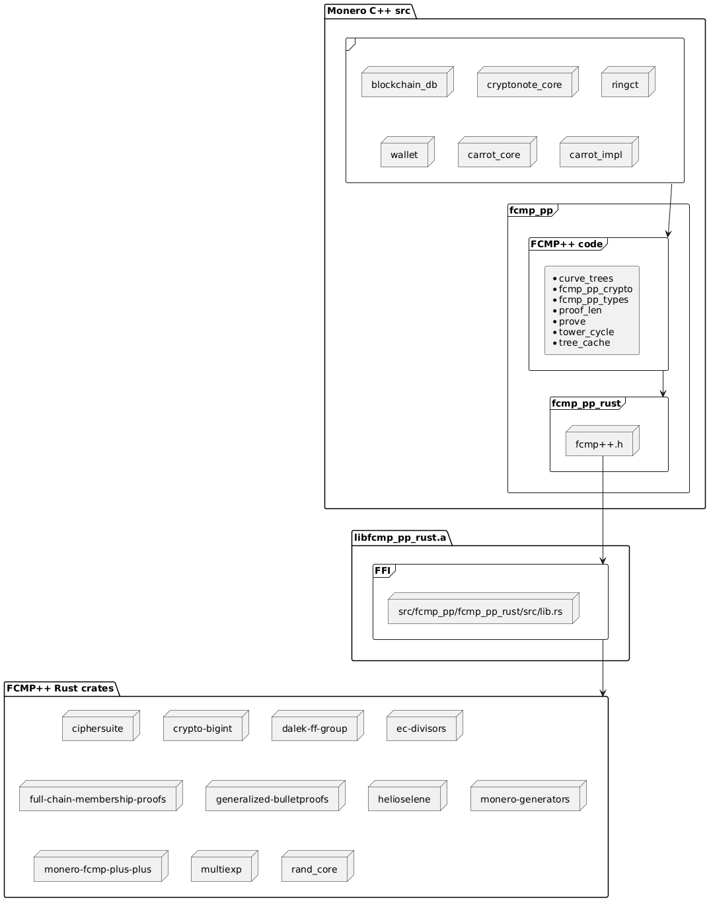

# FCMP++ Integration

This documentation provides useful information explaining the full-chain membership proof (FCMP++) integration. The integration roughly follows section 6 of the specification written by @kayabaNerve ([paper](https://github.com/kayabaNerve/fcmp-ringct/blob/develop/fcmp%2B%2B.pdf), [commit](https://github.com/kayabaNerve/fcmp-plus-plus-paper/blob/6f01fd3296b17f90b5c97c738cc3320e3369ad49/fcmp%2B%2B.pdf)).

Here are the core components of the integration:

1. [Rust FFI](#1.rust-ffi)
2. [Curve trees merkle tree](#2.curve-trees-merkle-tree)
    1. Preparing locked outputs for insertion to the tree upon unlock
    2. `grow_tree` algorithm
    3. Grow the tree as the node syncs
    4. Trim the tree on reorg and on pop blocks
    5. LMDB changes
    6. Migrating cryptonote outputs into the tree
3. [Transaction struct changes for FCMP++](#3.transaction-struct-changes-for-fcmp)
4. [Constructing FCMP++ transactions](#4.constructing-fcmp-transactions)
5. [Verifying FCMP++ transactions](#5.verifying-fcmp-transactions)
6. [Consensus changes for FCMP++](#6.consensus-changes-for-fcmp)
7. [Wallet sync](#7.wallet-sync)
    1. Tree cache
    2. Handling restore from an arbitrary restore height
8. Daemon RPC: fetching outputs by output ID
9. `scan_tx`

# 1. Rust FFI

Since much of the full-chain membership proof++ code is written in Rust, we implement a Foreign Function Interface ([FFI](https://doc.rust-lang.org/nomicon/ffi.html)) to call the Rust code from C++. Using cmake, the Rust code is compiled into a static lib (`libfcmp_pp_rust.a`) when you run `make` from the root of the monero repo. The static lib's functions are exposed via the C++ header file `src/fcmp_pp/fcmp_pp_rust/fcmp++.h` (generated with the help of [cbindgen](https://github.com/mozilla/cbindgen) and modified slightly). The heavy lifting on the Rust side is done in the crates located in the [`monero-oxide` repo](https://github.com/monero-oxide/monero-oxide/tree/fcmp%2B%2B).

The Rust has clear responsibilities: math on Helios and Selene curves, FCMP++ construction, and FCMP++ verification.

The C++ has clear responsibilities: manage tree state, update/read the db, ed25519 math, tx changes, RPC routes.

Here is what the structure looks like at time of writing:

<p align="center">
  
</p>

# 2. Curve trees merkle tree

The curve trees merkle tree is a new store for **spendable** transaction outputs in the chain. FCMP++'s work by proving you own (and can spend) an output in the tree, without revealing which output is yours. All existing **valid** cryptonote outputs will be inserted into the tree **as soon as the outputs unlock**. Once an output is in the tree, users can construct FCMP++'s with that output. Thus, the anon set will roughly be the entire chain since genesis.

The leaves in the tree are composed of output tuples `{O.x, O.y, I.x, I.y, C.x, C.y}`, and each layer after the leaf layer is composed of hashes of chunks of the preceding layer, as follows:

```
leaves:  [O.x,O.y,I.x,I.y,C.x,C.y,O.x,O.y,I.x,I.y,C.x,C.y,...]
layer 0: [Hash(first chunk of leaves), Hash(next chunk of leaves),...]
layer 1: [Hash(first chunk of layer 0 hashes), Hash(next chunk of layer 0 hashes)...]
...
```

Each layer is composed of points alternating on two curves (@tevador's proposed [Selene and Helios curves](https://gist.github.com/tevador/4524c2092178df08996487d4e272b096)).

- The leaves in the tree are Selene scalars (we convert ed25519 points to Selene scalars).
- The layer after leaves is composed of points on the Selene curve (we hash chunks of Selene scalars from the leaf layer to get this layer's Selene points).
- The following layer is composed of points on the Helios curve (we convert the prior layer's Selene points to Helios scalars, and hash chunks of those Helios scalars to get this layer's Helios points).
- The following layer is composed of points on the Selene curve (we convert the prior layer's Helios points to Selene scalars, and hash chunks of those Selene scalars to get this layer's Selene points), and so on...
- We continue until there is just one chunk in a layer to hash, leaving us with the tree root.

Each curve has a defined chunk width used when hashing the children in the preceding layer. The Selene layer has a chunk width of 38. The Helios layer has a chunk width of 18.

There are 3 critical steps to growing the tree:

1. Keep track of the every new output's last locked block.
2. Grow the tree with outputs as they unlock.
3. Update the database.

These are the core steps the function `handle_fcmp_tree` accomplishes, immediately after the daemon successfully adds a block to the chain inside `src/cryptonote_core/blockchain.cpp`'s `handle_block_to_main_chain`.

## 2.i. Curve trees merkle tree: Preparing locked outputs for insertion to the tree upon unlock

### Keeping track of outputs by last locked block

As an output enters the chain, we first need to determine each output's last locked block. We keep track of locked outputs by last locked block in the database, so we can grow the tree with unlocked outputs in the correct order. An output cannot be spent until the output's last locked block enters the chain. Recall the tree used to construct an FCMP++ proof is composed of **unlocked** outputs.

Take note of the function: `get_outs_by_last_locked_block`. Upon adding a block, the function iterates over all the block's tx outputs **in order**, and places the outputs in the struct `OutsByLastLockedBlockMeta`. We keep track of each output's last locked block in order to append the output to the tree in the correct order.

```cpp
struct OutsByLastLockedBlockMeta
{
    fcmp_pp::curve_trees::OutsByLastLockedBlock outs_by_last_locked_block;
    std::unordered_map<uint64_t/*output_id*/, uint64_t/*last locked block_id*/> timelocked_outputs;
    uint64_t next_output_id;
};

using OutsByLastLockedBlock = std::unordered_map<uint64_t/*block_idx*/, std::vector<OutputContext/*sorted in the order of appearance in the chain*/>>;

// Contextual wrapper for the output
struct OutputContext final
{
    // Output's global id in the chain, used to insert the output in the tree in the order it entered the chain
    uint64_t output_id{0};
    // True if the output pair elems are guaranteed to not have torsion and are not equal to identity
    uint8_t torsion_checked{0};
    OutputPair output_pair;
};

// Output pub key and commitment, ready to be converted to a leaf tuple
// - From {output_pubkey,commitment} -> {O,C} -> {O.x,O.y,I.x,I.y,C.x,C.y}
struct OutputPair final
{
    crypto::public_key output_pubkey;
    rct::key           commitment;
};
```

### Adding locked outputs to the db

When actually using outputs to grow the tree, we implement a nifty approach in order to maximize security for SPV syncing clients. When block n is added to the chain, the earliest that *any* of the outputs created in block n can be spent in the chain is in block n+10, since the `CRYPTONOTE_DEFAULT_TX_SPENDABLE_AGE` is 10 blocks. **This effectively means that as soon as block n enters the chain, we can know exactly what the tree of all unlocked and spendable outputs will be when block n+9 enters the chain.** As soon as block n enters the chain, the tree usable once block n+9 enters the chain is immutably set and cannot change (unless there is a reorg that reorgs block n out of the chain). We take advantage of this to grow the tree immediately once block n enters the chain, effectively keeping the tree *ahead* of the main chain. Thus, when block n enters the chain, we construct the tree usable in FCMP++ proofs once block n+9 enters the chain.

With the above context in mind, all outputs created in block n that have last locked block n+9 (i.e. normal outputs with the `CRYPTONOTE_DEFAULT_TX_SPENDABLE_AGE`) are added to the tree **immediately** upon adding block n, in addition to any other outputs with the same last locked block. We **do not** have to keep track of *default* outputs in the db for insertion to the tree at a later time, instead we add them immediately. We **do** keep track of outputs that have last locked block *greater* than the default. Thus, you see the following code inside `handle_fcmp_tree`:

```cpp
// Insert the new locked outputs into the db, excluding outputs created in
// this block with default last locked block. Outputs with default last locked
// block will be added to the tree immediately below. Outputs with last
// locked block higher than the default will be added to the locked outputs
// tables, staged for insertion to the tree later.
new_locked_outs.outs_by_last_locked_block.erase(default_last_locked_block);
db->add_locked_outs(new_locked_outs.outs_by_last_locked_block, new_locked_outs.timelocked_outputs);
```

#### The benefit of keeping tree ahead of the chain

Keeping the tree *ahead* of the chain is beneficial for SPV sync because we include block n+9's tree root in block n+1's PoW hash. Assume the chain has 100 blocks in it. A user constructs an FCMP++ tx and submits it to an SPV node. The FCMP++ proof will prove membership in the tree composed of all spendable outputs **with last locked block 100 or lower**. That tree root was included in block 92's PoW hash. Thus, when the chain has 100 blocks in it, new FCMP++ txs will reference a tree root that has 9 blocks of PoW built on top of it already (blocks 92 to 100). SPV nodes therefore have stronger confidence these txs are valid than if the tree was grown at pace with the chain.

### Determining an output's last locked block

```cpp
// Returns the last locked block index for the provided unlock_time
uint64_t get_last_locked_block_index(uint64_t unlock_time, uint64_t block_included_in_chain);
```

The idea behind this function is to have a deterministic and efficient method of growing the tree when outputs unlock.

Most outputs in the chain don't include an `unlock_time`; those outputs unlock 10 blocks after they are included in the chain.

Some outputs include an `unlock_time` which should either be interpreted as the *height* at which an output should unlock, or the *time* at which an output should unlock. When the `unlock_time` should be interpreted as height, the response to `get_last_locked_block_index` is trivial. When interpreted as time, the logic is less straightforward. We use the prior hard fork's block and time as an anchor point, and determine the output's last locked block from that anchor point. By converting timestamped `unlock_time` to a deterministic last locked block, we avoid needing to search for outputs that unlock by timestamp, and can efficiently query for outputs with a specific last locked block.

Note it is possible (likely) for the returned `last_locked_block_index` to be distinct from current consensus' enforced unlock block **for timestamp-based locked outputs only**. The proposal is for consensus to enforce this new rule for FCMP++ txs, meaning that users won't be able to construct an FCMP++ tx spending outputs until the outputs unlock according to the rules of  `get_last_locked_block_index`.

## 2.ii. Curve trees merkle tree: `grow_tree`

This function takes a set of new outputs and uses them to grow the tree.

It has 3 core steps:

1. Get the number of leaf tuples currently in the tree, as well as the last hash (i.e. most recently inserted) from every layer.
2. Use the above two results to construct a tree extension, which we can use to extend the tree.
3. Use the tree extension to extend the tree.

Steps 1 and 3 are fairly straightforward. Step 2 carries the most weight and is the most complex. It's implemented in the `CurveTrees` class `get_tree_extension` function documented further below.

This step-wise approach enables clean separation of the db logic (steps 1 and 3) from the grow logic (step 2). It also enables reusable tree building code for wallet scanning.

#### `get_tree_extension`

```cpp
// Take in the existing number of leaf tuples and the existing last hash in each layer in the tree, as well as new
// outputs to add to the tree, and return a tree extension struct that can be used to extend a tree
TreeExtension get_tree_extension(const uint64_t old_n_leaf_tuples,
    const LastHashes &existing_last_hashes,
    std::vector<std::vector<OutputContext>> &&new_outputs,
    const bool use_fast_torsion_check = false) const;
```

`get_tree_extension` has 2 core steps:

1. Prepare new leaves for insertion into the tree.

    a. Sort new outputs by the order they appear in the chain (guarantees consistent insertion order in the tree).

    b. Convert valid outputs to leaf tuples (from the form `{output_pubkey,commitment}`to `{O,I,C}` to `{O.x,O.y,I.x,I.y,C.x,C.y}`).

    - Points must be checked for torsion.
    - Points with torsion must be torsion cleared before inserting into the tree.
    - We cannot insert points that are **not** on ed25519 into the tree, nor points equal to identity after clearing torsion.
    - Thus we ignore any outputs which have `output_pubkey` or `commitment` that are not on the ed255129 curve, or are equal to identity after clearing torsion.
    - Such outputs should either not be spendable today or are worth 0.
    - See the `CurveTrees<Selene, Helios>::set_valid_leaves` function for the code.

    c. Place all leaf tuple members in a flat vector (`[{output 0 output pubkey and commitment}, {output 1 output pubkey and commitment},...]` becomes`[O.x,O.y,I.x,I.y,C.x,C.y,O.x,O.y,I.x,I.y,C.x,C.y,...]`).

2. Go layer by layer, hashing chunks of the preceding layer, and place results in the `TreeExtension` struct.

    a. Get `GrowLayerInstructions` for the current layer.
      - The logic to get `GrowLayerInstructions` for the *first* layer after the leaf layer is distinct from all other layers after.
      - Using just the `old_total_children`, `new_total_children`, `parent_chunk_width`, and a bool for whether or not the `last_child_will_change`, we can determine how exactly we expect a layer to grow.
      - There are edge cases to watch out for. Edge case examples:
        - Example 1: the existing last hash in a layer may *change* from an old value to a new value.
        - Example 2: to efficiently update a hash from an old value to a new value, we may need to use the old AND new value of the prior last child because that child updated as well.
        - Example 3: if we need to use the old value of the prior last child, we need to adjust the offset we use to hash chunks.
        - Example 4: we may be adding a new layer after the existing root, and may need to use the existing root to get the next layer's first hash.

    b. Get the `LayerExtension` for the current layer to add to the `TreeExtension` struct.
      - We use `GrowLayerInstructions` to determine correct values when hashing the preceding "child" layer.

## 2.iii. Curve trees merkle tree: Grow the tree as the node syncs

As soon as a block is added to the chain, we call `handle_fcmp_tree` to grow the tree. Assume we're adding block index 91 to the chain, and follow along below, noting that the default last locked block of outputs created in block index 91 is block 100:

```cpp
static void handle_fcmp_tree(BlockchainDB *db, const uint64_t block_idx, const uint64_t first_output_id, const std::vector<std::reference_wrapper<const transaction>> &tx_refs, const std::unordered_map<uint64_t, rct::key> &transparent_amount_commitments)
{
  // Collect outs by last locked block to add to the db
  OutsByLastLockedBlockMeta new_locked_outs = cryptonote::get_outs_by_last_locked_block(tx_refs, transparent_amount_commitments, first_output_id, block_idx);

  // Get the outputs with default last locked block
  const uint64_t default_last_locked_block = cryptonote::get_default_last_locked_block_index(block_idx);
  auto new_default_locked_outs_it = new_locked_outs.outs_by_last_locked_block.find(default_last_locked_block);
  const auto new_default_locked_outs = new_default_locked_outs_it != new_locked_outs.outs_by_last_locked_block.end()
    ? std::move(new_default_locked_outs_it->second)
    : std::vector<fcmp_pp::curve_trees::OutputContext>{};

  // Insert the new locked outputs into the db, excluding outputs created in
  // this block with default last locked block. Outputs with default last locked
  // block will be added to the tree immediately below. Outputs with last
  // locked block higher than the default will be added to the locked outputs
  // tables, staged for insertion to the tree later.
  new_locked_outs.outs_by_last_locked_block.erase(default_last_locked_block);
  db->add_locked_outs(new_locked_outs.outs_by_last_locked_block, new_locked_outs.timelocked_outputs);

  // Assume we just added block n. The soonest that outputs from block n can be
  // included in the chain is in block n + CRYPTNOTE_DEFAULT_SPENDABLE_AGE. So
  // we grow the tree with these outputs (and any others with last locked block
  // n + CRYPTNOTE_DEFAULT_SPENDABLE_AGE - 1). We then expect this tree root
  // be included in block header n+1. This way miners will build on top of the
  // tree root usable in FCMP++'s in a future block. After block
  // n + (CRYPTNOTE_DEFAULT_SPENDABLE_AGE - 1) is added to the chain, SPV
  // clients syncing just block headers will have a solid assurance that the
  // root usable to construct FCMP++ proofs is the correct root, since it will
  // have 9 blocks of PoW on top of it.
  // To be clear, block header n+1 includes the tree root usable to spend
  // outputs with last locked block n + CRYPTNOTE_DEFAULT_SPENDABLE_AGE - 1.
  static_assert(CRYPTONOTE_DEFAULT_TX_SPENDABLE_AGE > 0, "Expect a non-0 spendable age");
  db->advance_tree(block_idx, new_default_locked_outs);
}
```

For further explanation on why we keep the tree *ahead* of the main chain, and immediately grow with *default* locked outputs, see the above section 1.i.

`BlockchainDB::advance_tree` is the db function that actually extends the tree. Keep in mind we're calling it with `blk_idx = 91`:

```cpp
void BlockchainDB::advance_tree(const uint64_t blk_idx, const std::vector<fcmp_pp::curve_trees::OutputContext> &known_new_outputs)
{
  LOG_PRINT_L3("BlockchainDB::" << __func__);

  // Get the earliest possible last locked block of outputs created in blk_idx
  const uint64_t earliest_last_locked_block = cryptonote::get_default_last_locked_block_index(blk_idx);

  // If we're advancing the genesis block, make sure to initialize the tree
  if (blk_idx == 0)
  {
    // Expected: tree meta table is currently empty

    // We grow the first blocks with empty outputs, since no outputs in this range should be spendable yet
    for (uint64_t new_blk_idx = blk_idx; new_blk_idx < earliest_last_locked_block; ++new_blk_idx)
    {
      this->grow_tree(new_blk_idx, {});
    }
  }
  // Expected: earliest_last_locked_block == last block idx + 1 in tree meta

  // Now we can advance the tree 1 block
  auto unlocked_outputs = this->get_outs_at_last_locked_block_idx(earliest_last_locked_block);

  // Include known new outputs if provided
  unlocked_outputs.insert(unlocked_outputs.end(), known_new_outputs.begin(), known_new_outputs.end());

  // Grow the tree with outputs that are spendable once the earliest_last_locked_block is in the chain
  this->grow_tree(earliest_last_locked_block, std::move(unlocked_outputs));

  // Now that we've used the unlocked leaves to grow the tree, we delete them from the locked outputs table
  this->del_locked_outs_at_block_idx(earliest_last_locked_block);
}
```

Note that `earliest_last_locked_block` will be 100. The db function `get_outs_at_last_locked_block_idx` reads for all locked outputs saved in the db with default last locked block 100. This would be coinbase outputs or outputs with `unlock_time` explicitly set. We then combine default outputs added in block 91 with all other outputs with last locked block 100 from the db in `unlocked_outputs`. Then we grow the tree with those outputs. After successfully growing, we delete all the locked outputs saved in the db with last locked block 100, since we no longer need them saved in the staging area. They have been successfully appended to the tree.

When actually growing the tree inside `grow_tree`, the only existing values from the tree that we need are the *last* values at each layer of the tree. In other words, we need the right-most edge of the tree. With the last values from the tree, and the number of existing leaves in the tree, we have all we need to grow the tree. Thus, we make sure to read both from the db when growing the tree.

To speed up *trimming* the tree, we save the tree edge for each block in the db, as well as the number of leaves in the tree. Continuing with our example, when adding block 91 to the chain, we grow the tree using outputs with last locked block 100. Which means we need the right-most edge of the tree saved after growing the tree using outputs with last locked block 99. If the tree is not actually going to grow (because there are no valid outputs with last locked block 100), then we simply re-save the previous tree edge and number of leaf tuples, tying that to block 100 in the db.

The above is all context to understand `BlockchainDB::grow_tree` (note `blk_idx` is set to 100 in the example):

```cpp
void BlockchainDB::grow_tree(const uint64_t blk_idx, std::vector<fcmp_pp::curve_trees::OutputContext> &&new_outputs)
{
  LOG_PRINT_L3("BlockchainDB::" << __func__);

  MDEBUG("Growing tree usable once block " << blk_idx << " is in the chain");

  // Get the number of leaf tuples that exist in the current tree
  const uint64_t old_n_leaf_tuples = this->get_n_leaf_tuples();

  if (blk_idx == 0)
    CHECK_AND_ASSERT_THROW_MES(old_n_leaf_tuples == 0, "Tree is not empty at blk idx 0");

  // Get the prev block's tree edge (i.e. the current tree edge before growing)
  std::vector<crypto::ec_point> prev_tree_edge;
  uint64_t prev_blk_idx = 0;
  if (blk_idx > 0)
  {
    prev_blk_idx = blk_idx - 1;

    // Make sure tree tip lines up to expected block
    const uint64_t tree_block_idx = this->get_tree_block_idx();

    CHECK_AND_ASSERT_THROW_MES(tree_block_idx == prev_blk_idx,
      "Unexpected tree block idx mismatch to prev block (" + std::to_string(tree_block_idx) + " vs " + std::to_string(prev_blk_idx) + ")");

    prev_tree_edge = this->get_tree_edge(prev_blk_idx);
  }

  // We re-save the prev tree edge at this next block if the tree doesn't grow
  const auto save_prev_tree_edge = [&, this]() { this->save_tree_meta(blk_idx, old_n_leaf_tuples, prev_tree_edge); };
  if (new_outputs.empty())
  {
    save_prev_tree_edge();
    return;
  }

  // Set the tree's existing last hashes from the existing edge
  const auto last_hashes = m_curve_trees->tree_edge_to_last_hashes(prev_tree_edge);

  // Use the number of leaf tuples and the existing last hashes to get a struct we can use to extend the tree
  auto tree_extension = m_curve_trees->get_tree_extension(old_n_leaf_tuples, last_hashes, {std::move(new_outputs)}, false/*use_fast_torsion_check*/);
  if (tree_extension.leaves.tuples.empty())
  {
    save_prev_tree_edge();
    return;
  }

  const uint64_t new_n_leaf_tuples = tree_extension.leaves.tuples.size() + old_n_leaf_tuples;
  const auto tree_edge = this->grow_with_tree_extension(tree_extension);
  this->save_tree_meta(blk_idx, new_n_leaf_tuples, tree_edge);
}
```

`BlockchainLMDB::grow_with_tree_extension` strictly reads values from the `tree_extension` and inserts them into the db.

## 2.iv. Curve trees merkle tree: Trim the tree on reorg and on pop blocks

### `BlockchainDB::trim_block()`

- On reorg/pop blocks, blocks are removed 1 block at a time via `BlockchainLMDB::remove_block()`.
- Inside `BlockchainLMDB::remove_block()`, we call `BlockchainDB::trim_block()`.
- When removing block n from the chain, we revert the tree state to what it was before adding block n to the chain.
- As explained above, when adding block n to the chain, we grow the tree with outputs with last locked block n+9.
- Thus, when removing block n from the chain, we revert the tree state to what it was before adding outputs with last locked block n+9 to the tree.
- In order to get the previous tree state we want to revert to, we therefore need the tree meta tied to block n+8.

```cpp
void BlockchainDB::trim_block()
{
  LOG_PRINT_L3("BlockchainDB::" << __func__);

  const uint64_t n_blocks = this->height();
  if (n_blocks == 0)
    return;

  const uint64_t removing_block_idx = n_blocks - 1;

  // Get the earliest possible last locked block of outputs created in removing_block_idx
  const uint64_t default_last_locked_block = cryptonote::get_default_last_locked_block_index(removing_block_idx);
  const uint64_t tree_block_idx = this->get_tree_block_idx();

  CHECK_AND_ASSERT_THROW_MES(tree_block_idx > 0, "tree block idx must be >0");
  CHECK_AND_ASSERT_THROW_MES(tree_block_idx == default_last_locked_block,
    "Unexpected tree block idx mismatch (" + std::to_string(tree_block_idx) + " vs " + std::to_string(default_last_locked_block) + ")");

  const uint64_t prev_tree_block_idx = tree_block_idx - 1;

  MDEBUG("Trimming tree to block " << prev_tree_block_idx << " (removing block " << removing_block_idx << ")");

  // Read n leaf tuples from the prev tree block to see how how many leaves
  // should remain in the tree after trimming a block from the tree.
  const uint64_t new_n_leaf_tuples = this->get_block_n_leaf_tuples(prev_tree_block_idx);

  // Trim the tree to the new n leaf tuples
  this->trim_tree(new_n_leaf_tuples, tree_block_idx);

  // Remove block from tree meta
  this->del_tree_meta(tree_block_idx);
}
```

### `BlockchainDB::trim_tree(const uint64_t new_n_leaf_tuples, const uint64_t trim_block_idx)`

Inside `BlockchainDB::trim_tree`, we first trim leaves from the tree, then trim any layers as necessary. In order to trim the layers to the previous state correctly, we **not only** need to know how many elements there will be in a layer after trimming, but we will also need the previous tree edge to know what the last value in each layer is supposed to be. When trimming a single block, we are removing the right-most leaves from the tree. Thus, at each layer after leaves, we either delete elements, or modify a *single* element: the new last value of the layer. The new last value of each layer becomes the tree edge as it was after adding outputs with last locked block n+8 to the tree. Thus, we use the previous tree edge as it was in order to update the last value of each layer.

```cpp
void BlockchainDB::trim_tree(const uint64_t new_n_leaf_tuples, const uint64_t trim_block_idx)
{
  LOG_PRINT_L3("BlockchainDB::" << __func__);

  const uint64_t old_n_leaf_tuples = this->trim_leaves(new_n_leaf_tuples, trim_block_idx);

  // If nothing to trim, return
  if (old_n_leaf_tuples == new_n_leaf_tuples)
    return;

  if (new_n_leaf_tuples == 0)
  {
    // Empty the tree
    this->trim_layers(new_n_leaf_tuples, {}/*n_elems_per_layer*/, {}/*prev_tree_edge*/, 0/*expected_root_idx*/);
    return;
  }

  // Trim the expected layers
  const auto n_elems_per_layer = m_curve_trees->n_elems_per_layer(new_n_leaf_tuples);
  const auto prev_tree_edge = this->get_tree_edge(trim_block_idx - 1);
  const uint64_t expected_root_idx = m_curve_trees->n_layers(new_n_leaf_tuples) - 1;
  this->trim_layers(new_n_leaf_tuples, n_elems_per_layer, prev_tree_edge, expected_root_idx);
}
```

Inside `trim_leaves`, we read all the outputs we're going to remove from the db, then delete them from the leaves table. Then we re-add the deleted outputs back to the locked outputs table, so that they can be re-added later upon re-growing the tree. Note: after calling `BlockchainLMDB::remove_block()`, the daemon removes all of the block's transactions from the db via `BlockchainLMDB::remove_transaction`. This removes all the block's created outputs inside `BlockchainLMDB::remove_output`. `BlockchainLMDB::remove_output` **also** removes the output from the locked outputs table if it's present. Thus, `trim_leaves` may place *default* outputs created in block n back in the locked outputs table, and then the outputs will be removed agin from the locked outputs table in `remove_output`.

Inside `trim_layers`, we delete all layer elements needed from each layer, and update the last layer element using the previous tree edge.

## 2.v. Curve trees merkle tree: LMDB changes

The following changes to the db are necessary in order to store and update the curve trees merkle tree.

### **NEW: `locked_outputs` table**

Potential outputs to be inserted into the merkle tree, indexed by each outputs' last locked block ID.

```
Key: `block ID`
Data: `[{OutputContext}...]`
DB Flags: `MDB_INTEGERKEY | MDB_DUPSORT | MDB_DUPFIXED | MDB_CREATE`
```

We store the complete OutputContext to guarantee outputs are inserted into the tree in the order they appear in the chain.

This table stores the output pub key and commitment (64 bytes) instead of `{O.x,O.y,I.x,I.y,C.x,C.y}`, since the latter (192 bytes) can be derived from the output pub key and commitment. Note that we should theoretically be able to stop storing the output public key and commitment in the `output_amounts` table at the hard fork, since that table should only be useful to construct and verify pre-FCMP++ txs.

### **NEW: `leaves` table**

Leaves in the tree.

```
Key: `leaf_idx`
Data: `{output_id}`
DB Flags: `MDB_INTEGERKEY | MDB_DUPSORT | MDB_DUPFIXED | MDB_CREATE`
```

We store the output ID so that when we trim the tree, we know where to place the output back into the locked outputs table.

Note we also use the dummy zerokval key optimization for this table as explained in [this comment](https://github.com/monero-project/monero/blob/a1dc85c5373a30f14aaf7dcfdd95f5a7375d3623/src/blockchain_db/lmdb/db_lmdb.cpp#L207-L211):

```
 * Note: where the data items are of uniform size, DUPFIXED tables have
 * been used to save space. In most of these cases, a dummy "zerokval"
 * key is used when accessing the table; the Key listed above will be
 * attached as a prefix on the Data to serve as the DUPSORT key.
 * (DUPFIXED saves 8 bytes per record.)
```

### **NEW: `layers` table**

Each record is a 32 byte hash of a chunk of children, as well as that hash's position in the tree.

```
Key: `layer_idx`
Data: `[{child_chunk_idx, child_chunk_hash}...]`
DB Flags: `MDB_INTEGERKEY | MDB_DUPSORT | MDB_DUPFIXED | MDB_CREATE`
```

The `layer_idx` is indexed starting at the layer after the leaf layer (i.e. `layer_idx=0` corresponds to the layer after the leaf layer).

Example: `{layer_idx=0, child_chunk_idx=4, child_chunk_hash=<31fa...>}` means that the `child_chunk_hash=<31fa...>` is a hash of the 5th chunk of leaves, and is a Selene point. Another example: `{layer_idx=1, child_chunk_idx=36, child_chunk_hash=<a2b5...>}` means that the `child_chunk_hash=<a2b5...>` is a hash of the 37th chunk of elements from `layer_idx=0`, and is a Helios point.

An even `layer_idx` corresponds to Selene points. An odd `layer_idx` corresponds to Helios points.

The element with the highest `layer_idx` is the root (which should also be the last element in the table). There should only be a single element with the highest `layer_idx` (i.e. only one data item with key == max `layer_idx`).

### **NEW: `tree_edges` table**

The right-most edge of the tree (i.e. the last member of each layer in the tree) when a specific block is the highest block in the chain.

```
Key: `block ID`
Data: `[child_chunk_hash]`
DB Flags: `MDB_INTEGERKEY | MDB_CREATE`
```

The number of chunk hashes corresponds to the number of layers in the tree, excluding the leaf layer. The hashes are stored ordered in the database. The first `child_chunk_hash` for a given block ID corresponds to `layer_idx=0` i.e. the layer after the leaf layer. The last `child_chunk_hash` for a given block ID coresponds to the tree root.

### **NEW: `tree_meta` table**

Tree metadata when a specific block is the highest block in the chain.

```
Key: `block ID`
Data: `{n_leaf_tuples}`
DB Flags: `MDB_INTEGERKEY | MDB_CREATE`
```

Enables an efficient query to determine how many leaf tuples there are in the tree assuming a specific block is highest in the chain.

## 2.vi. Curve trees merkle tree: Migrating cryptonote outputs into the tree

All existing cryptonote outputs need to be migrated into the merkle tree.

- The migration determines every output's last locked block and places them in the locked outputs table, and then grows the tree block by block with valid outputs.
- The migration must run to completion before a node can start normal sync, same as past migrations.
  - If the node is killed while the migration is ongoing, the migration will resume from where it left off upon restarting the node.
- The migration has 2 steps:
  1. Migrate outputs into the new `locked_outputs` table.
  2. Grow the tree block by block.
- The migration can theoretically be made asynchronous (it can run in the background while nodes start immediately, until the hard fork when the migration **must** run before nodes can continue syncing). Such a change would be a solid lift.

# 3. Transaction struct changes for FCMP++

### `cryptonote::transaction::rctSig`

This section describes changes to the `rctSig` for FCMP++ txs. The `tx_fcmp_pp` serialization test demonstrates what an expected dummy `transaction` struct looks like with dummy data.

#### `rctSigBase`

Added a new `RCTType` enum usable in the `type` member of `rctSigBase`:

```cpp
RCTTypeFcmpPlusPlus = 7
```

FCMP++ txs are expected to use this `RCTType` instead of `RCTTypeBulletproofPlus` (even though FCMP++ txs are still expected to have a bp+ range proof).

#### `rctSigPrunable`

Added 3 new members:

```cpp
uint64_t reference_block{0}; // used to get the tree root as of when this reference block index enters the chain
uint8_t n_tree_layers{0}; // number of layers in the tree as of the block when the reference block index enters the chain
fcmp_pp::FcmpPpProof fcmp_pp; // FCMP++ SAL and membership proof
```

Non-0 values are expected on txs of `rctSigBase.type == RCTTypeFcmpPlusPlus`.

Note there is a single opaque FCMP++ struct per tx. The `FcmpPpProof` type is simply a `std::vector<uint8_t>`. The length of the `FcmpPpProof` is deterministic from the number of inputs in the tx and curve trees merkle tree depth. Thus, when serializing and de-serializing, we don't need to store the vector length, and can expect a deterministic number of bytes for the `FcmpPpProof` by calling `fcmp_pp::proof_len(inputs, n_tree_layers)`.

There is also a new member that is reconstructed, not serialized, in order to help verify FCMP++ proofs:

```cpp
fcmp_pp::FcmpVerifyHelperData fcmp_ver_helper_data; // used to verify FCMP proofs (not serialized, reconstructed)
```

```cpp
struct FcmpVerifyHelperData final
{
    TreeRootShared tree_root;
    std::vector<crypto::key_image> key_images;
};
```

`TreeRootShared` is a shared pointer to a FFI-friendly tree root type.

# 4. Constructing FCMP++ transactions

TODO

# 5. Verifying FCMP++ transactions

TODO

# 6. Consensus changes for FCMP++

TODO

# 7. Wallet sync

TODO


